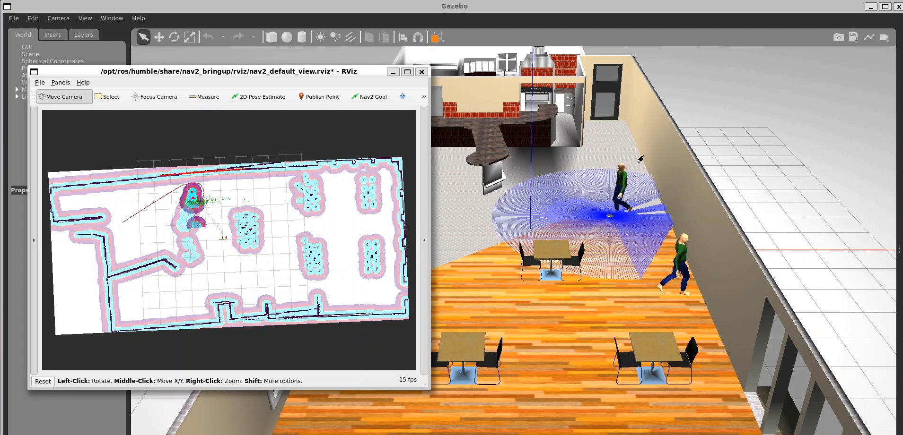

Here, Probabilistic Roadmap (PRM) and Adaptive Monte Carlo Localization (AMCL), along with the Robot Operating System (ROS) and Gazebo simulation, are used to solve the tasks. The TurtleBot3 robot, equipped with a laser distance sensor and camera module, is used for validation. Mapping involves teleoperation and frontier-based exploration, generating binary occupancy maps in MATLAB. Localization is performed using a particle filter, and navigation includes evaluating ROS2 Nav2 and implementing a PRM planner in MATLAB.

**Skills**: Mobile Robotics · Robot Operating System (ROS) · ROS2 · Ubuntu · Gazebo · MATLAB