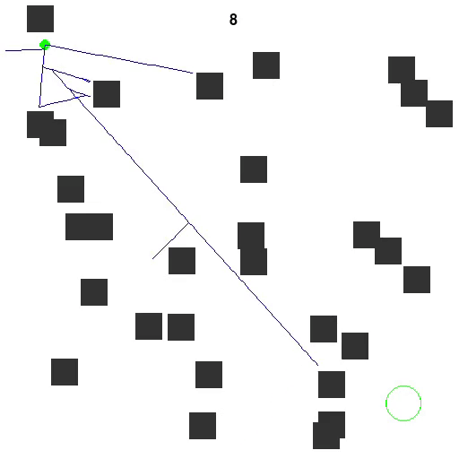

*This was the main project of the course "Robot Task and Motion Planning" at KAIST.*

This project was intended to make the students truly understand and appreciate why sampling-based motion planning algorithms have become the dominant paradigm in robotics. The students were required to implement several sampling-based algorithms and answer a series of questions that tested their understanding of motion planning algorithms.

Skills: Robotics · Motion Planning · Python